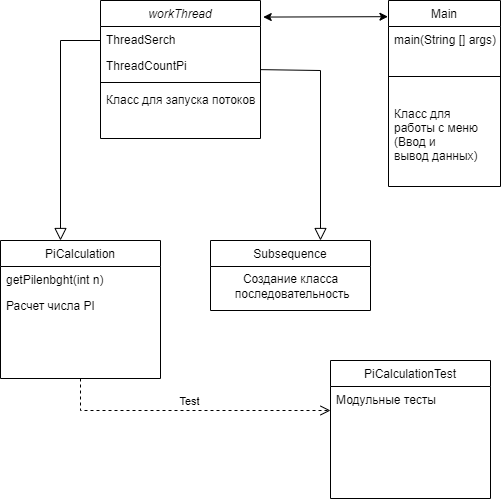

# sequenceInTheNumberPi.jar

Программа по определению позиции последовательности в числе Пи

JAR файл находится непосредвтсвенно в самом проекте под названием sequenceInTheNumberPi.jar

Количество обработанных символов в течении 5 минут ( на моем ПК): 7075

Диаграмма классов: 

